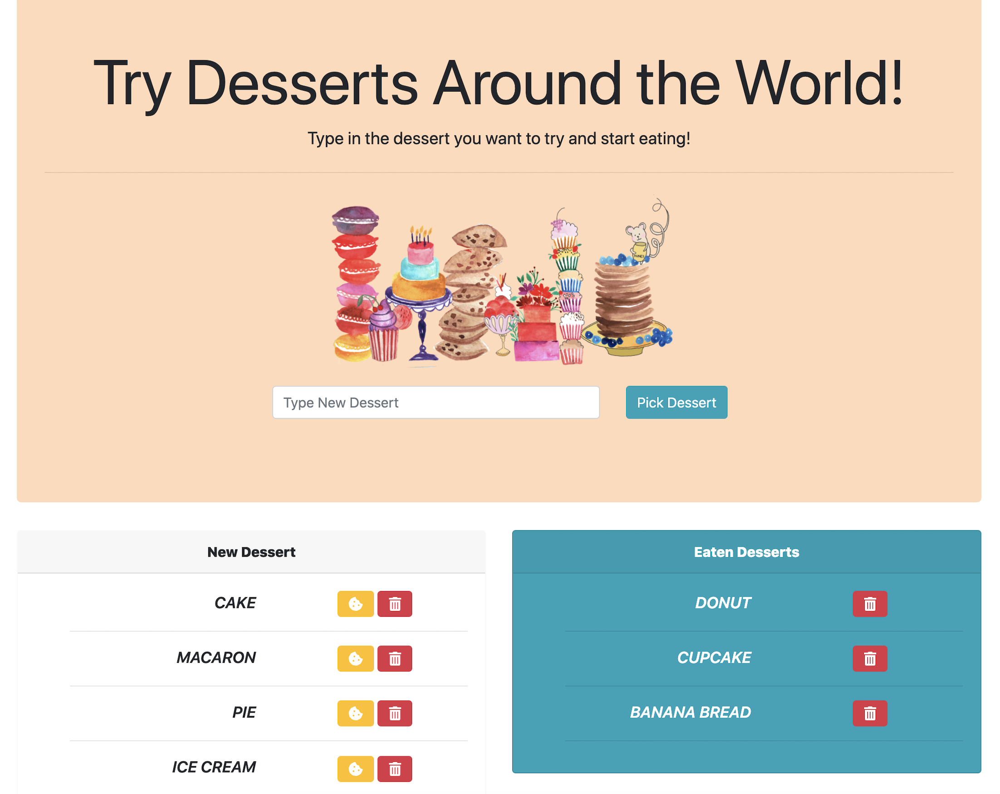

# sequelizedBurger-

This may seem like deja vu but eat all the desserts your heart desires! Instead of an ORM we are using Sequelize!

Here the user can enter any DESSERT name which will add it to the markee of **"New Desserts"**, which is on the left sid of the page. This also adds the dessert to the MySQL database. The user then has the options of **eating** the dessert by pressing the cookie or **deleting** the dessert by clicking the trash can.

Once the cookie is clicked the item will be moved to the **"Eaten Desserts"**. Here you can leave the desserts there to remember which you have eaten or delete them to keep it your little secret shhhhh....

## Technologies Required for Homework:

- jQuery
- Sequelize
- Node.js
- Express.js
- Handlebars.js
- mySQL Database
- express
- Heroku
- JawsDB

## Demo application here:

 https://obscure-waters-12214.herokuapp.com/
